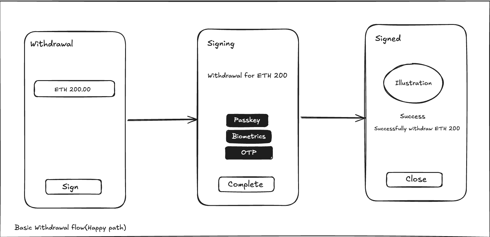
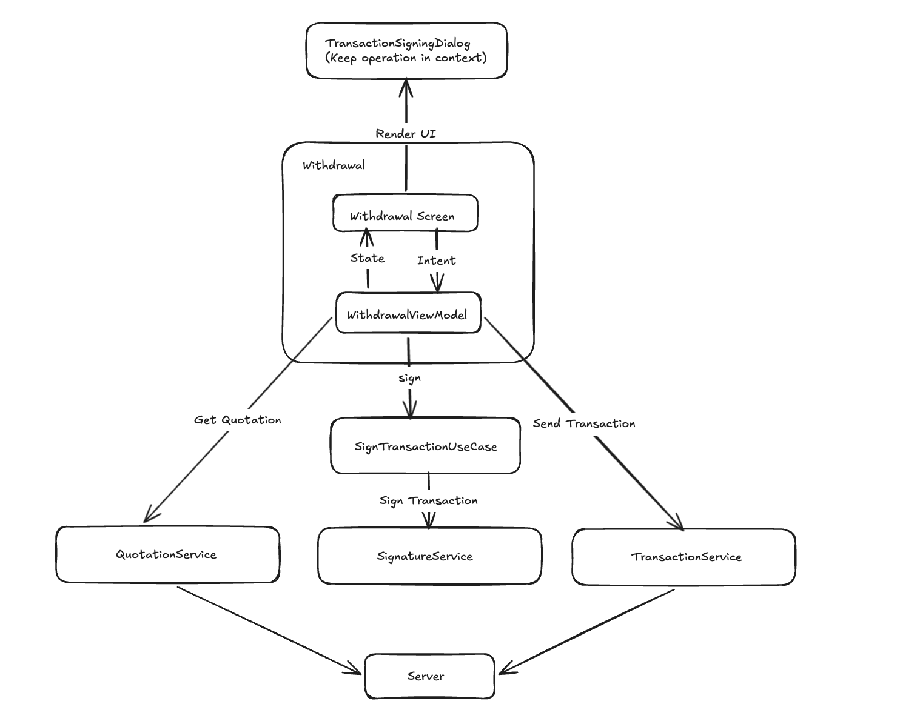

# TranzSign: Technical Assessment Submission

This project is a high-precision Ethereum withdrawal implementation developed as a technical showcase. The goal was to solve the core challenges of DeFi mobile engineering: managing 18-decimal precision (Wei), orchestrating multi-step transaction lifecycles, and delivering a localized, high-trust financial UI.

## 🧠 Architectural Thinking

**Basic Withdrawal Flow**

### Reactive Workflow Management
Instead of a monolithic process, I designed the transaction lifecycle as a series of reactive stages. The `SignTransactionUseCase` is a stateless, functional unit that returns a `Flow`. This decoupling allows the ViewModel to act as the primary coordinator—managing the transition from cryptographic signing to network submission. This approach keeps the business logic flexible and ensures that long-running async operations don't "leak" into the UI state.

### Why I chose MVI (Unidirectional Data Flow)
In a withdrawal flow, everything is interdependent: your balance, your input, the gas fee, and the withdrawal limit. I used a reactive `combine` strategy in the ViewModel to ensure these inputs are evaluated together in real-time. This means the "Confirm" button and error states react instantly to every keystroke, eliminating the "laggy" validation common in many crypto apps.

**High-Level Architectural Overview**

### Financial Accuracy & UI Stability
To avoid the precision loss inherent in floating-point math, all internal logic uses `BigInteger` (Wei). This ensures our app logic mirrors the Ethereum protocol exactly.
* **Conservative Truncation:** I enforced `RoundingMode.DOWN` for all displays. Rounding up a balance can lead to "Insufficient Funds" errors at the protocol level; truncation ensures we never promise a balance that the blockchain cannot fulfill.
* **The "Zero-Display" Problem:** To keep the UI clean, I standardized on a 4-decimal display. However, for non-zero values smaller than `0.0001`, the app renders `< 0.0001 ETH`. This provides visual confirmation that "dust" exists, preventing the customer support friction that occurs when a balance incorrectly appears as `0.000`.

### Transaction Integrity vs. Memory Management
A critical challenge in mobile wallet engineering is the "Orphaned Signature"—where a transaction is signed but the broadcast is interrupted by navigation or process death.

I prioritized **Transaction Integrity** by utilizing `withContext(NonCancellable)` during the submission phase.
* **The Choice:** If a user confirms a transaction and immediately exits the screen, the coroutine ignores the cancellation signal from the `viewModelScope` until the broadcast completes.
* **The Trade-off:** This creates a temporary "controlled leak" where the ViewModel stays in memory for a few additional seconds. This is a deliberate architectural choice to avoid the risk of un-broadcasted signatures, which is a higher risk in financial software than short-lived memory pressure.
* **The Production Path:** In a production-grade implementation, this logic would be moved to **WorkManager**. The signed challenge would be persisted to a local database (Room) to trigger a unique `OneTimeWorkRequest`. This is the necessary architectural pattern to ensure a signed transaction reaches the backend even in the event of a force-kill or device reboot.

### Global-Ready Formatting
The formatting engine is decoupled into a dedicated `MoneyFormatter`. It respects the User's OS Locale for decimal separators and intelligently places the "ETH" symbol based on regional standards (e.g., `1.2 ETH` vs `ETH 1,2`), ensuring the app feels like a native tool for a global audience.

## 🛠 Tech Choices
* **Jetpack Compose:** For a declarative UI that remains a pure reflection of the MVI state.
* **BigInteger/BigDecimal:** Zero-tolerance for precision loss in financial math.
* **Kotlin Flows:** Used to model the asynchronous nature of blockchain simulations and state updates.
* **Turbine:** Used in unit tests to verify the timing and sequence of the MVI state machine.

## 🛑 Scope & Assumptions
To stay focused on the architectural and mathematical challenges of the prompt, I have omitted standard "production" overhead:
* **CI/CD & Linting:** I've skipped custom linting rules, Ktlint, and CI pipeline configurations.
* **Analytics & Crashlytics:** No tracking or telemetry has been integrated.
* **Security:** This is a prototype; a production version would utilize the Android Keystore for private key management.
* **Backend:** Network calls are abstracted via an `InMemoryBackendService` to focus on the UI and domain logic.

## 📱 Demos
Demo screenshots and videos are available in the `docs` folder.

[Screen_recording_20260221_190930.webm](https://github.com/user-attachments/assets/f2539b1d-fa6c-4af5-b2c6-c713980100a4)